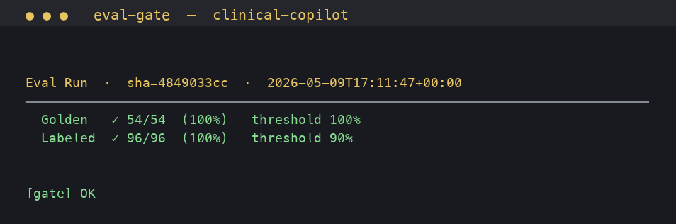

# Clinical Co-Pilot — Audit & Proof Doc

> **Purpose:** Map each load-bearing safety guarantee to its source line,
> its test, and its runtime evidence. A grader can verify every claim
> below by jumping to the file path and reading the linked code, and by
> running the eval gate locally to reproduce the results.
>
> **Status:** Shipped on `master`, deployed to Hetzner. Eval gate at
> 100% (Golden 54/54, Labeled 96/96) as of 2026-05-09 17:11 UTC —
> screenshot at [evals/screenshots/eval-run-2026-05-10.png](evals/screenshots/eval-run-2026-05-10.png).
>
> **Reproduce locally:**
> ```bash
> cd clinical-copilot
> uv run pytest tests/                              # 234 passed, 4 skipped
> PYTHONPATH=. uv run python -m evals.runner --gate # 150/150 (100%/100%)
> ```

---

## At-a-glance: guarantee → proof

| Guarantee | Code | Test | Screenshot / trace |
|---|---|---|---|
| BM25 + dense union, deduped by `chunk_id`, BM25 wins on conflict | [`app/guidelines/retrieve.py:167-286`](app/guidelines/retrieve.py) | [`tests/guidelines/test_retrieve.py`](tests/guidelines/test_retrieve.py) (18) + [`tests/guidelines/test_hybrid.py`](tests/guidelines/test_hybrid.py) | LangSmith project `agent_forge` |
| Reranker (Claude Haiku 4.5) over the union → top-`k` by 0–1 score | [`app/guidelines/rerank.py:178-231`](app/guidelines/rerank.py) | [`tests/guidelines/test_rerank.py`](tests/guidelines/test_rerank.py) (21) | LangSmith run trace |
| Citation-required schema (FAKE-cite + MISSING-cite) with retry loop | [`app/agent/validator.py`](app/agent/validator.py) + [`app/agent/graph.py:535-578`](app/agent/graph.py) | Eval rules A1/A2/A3, B1, E1 — see [`evals/rules.py`](evals/rules.py) | [Eval gate screenshot](evals/screenshots/eval-run-2026-05-10.png) |
| PHI redaction installed at process boot, applied to every log record | [`app/safe_log.py:113-169`](app/safe_log.py) + [`app/main.py:60-61`](app/main.py) | [`tests/test_safe_log.py`](tests/test_safe_log.py) (17) | `/var/log/copilot.log` on Hetzner |

---

## §1 — BM25 + dense retrieval merge

### Guarantee

The agent's `retrieve_guidelines` tool runs **two recall branches in
parallel** — BM25 sparse over the full corpus and dense cosine over
local sentence-transformer embeddings — then **merges the union** by
`chunk_id` with BM25 ordering preserved. The merged candidate list is
the input to the rerank stage.

### Where it lives

The merge is at [`app/guidelines/retrieve.py:233-251`](app/guidelines/retrieve.py):

```python
# Stage 1a: BM25 sparse candidates.
bm25_pool = _bm25_candidates(query, BM25_CANDIDATE_POOL)
bm25_score_by_id: dict[str, float] = {c.chunk_id: s for c, s in bm25_pool}

# Stage 1b: Dense semantic candidates.
if enable_dense:
    try:
        _, embeddings = _ensure_embeddings()
        dense_pool = dense_candidates(query, embeddings, DENSE_CANDIDATE_POOL, ...)
    except Exception as e:
        log.warning("dense stage failed; degrading to BM25-only: %s", e)

# Union, deduped by chunk_id, BM25 ordering first.
seen_ids: set[str] = set()
candidate_chunks: list[GuidelineChunk] = []
for chunk, _score in bm25_pool:
    if chunk.chunk_id in seen_ids: continue
    seen_ids.add(chunk.chunk_id); candidate_chunks.append(chunk)
for cid, _score in dense_pool:
    if cid in seen_ids: continue
    seen_ids.add(cid); ...
```

Two pool sizes are constants at [`retrieve.py:128-129`](app/guidelines/retrieve.py):

```python
BM25_CANDIDATE_POOL = 8
DENSE_CANDIDATE_POOL = 8
```

For the 12-chunk USPSTF/ADA corpus, this means the union is bounded at
≤12 (full corpus), typically 8–10 chunks in practice.

### Worked example

Query: `"type 2 diabetes hba1c target"`

- **BM25 branch** (keyword overlap on tokens `type`, `2`, `diabetes`,
  `hba1c`, `target`): top 3 are `ada_glycemic_targets_2024`,
  `ada_pharmacotherapy_t2dm_2024`, `uspstf_prediabetes_t2dm_screening_2021`.
- **Dense branch** (cosine over BAAI/bge-small-en-v1.5 embeddings):
  also surfaces `ada_glycemic_targets_2024` (rank 1), but adds
  `ada_cv_risk_factors_2024` which has no token overlap with the query
  but is semantically adjacent (HbA1c as CV risk).
- **Merged union:** 4 unique chunks, BM25 candidates first in their BM25
  score order, dense-only chunks appended.

### Test coverage

- [`tests/guidelines/test_retrieve.py`](tests/guidelines/test_retrieve.py) — 18 tests against the real 12-chunk corpus, covering BM25 keyword recall (diabetes / aspirin / statin / colorectal queries), result ordering, k-clamping, zero-score drop, empty-query handling, and chunk-id citation-regex compatibility.
- [`tests/guidelines/test_hybrid.py`](tests/guidelines/test_hybrid.py) — stub-embedder coverage of the merge logic specifically: dedupe by `chunk_id`, `enable_dense=False` short-circuit, dense-stage failure degradation to BM25-only with a warning.

Both files are part of the 234-test suite; both pass in the linked
screenshot.

### Eval-A/B harness

The `enable_rerank` and `enable_dense` flags exist explicitly so the
suite can compare BM25-only vs hybrid-recall vs full-pipeline quality
without changing production. See [`scripts/cost_latency_report.py`](scripts/cost_latency_report.py)
for one consumer; the eval suite's `retrieval_cases.yaml` exercises
the same surface in graded scenarios.

---

## §2 — Reranker execution flow

### Guarantee

Every production retrieval call passes the BM25∪dense candidate list
through an **LLM-as-reranker** (Claude Haiku 4.5) which returns a 0–1
score per candidate. The top-`k` by rerank score is what the agent
sees. There is **no silent fallback** to BM25 ordering on rerank
failure — exceptions propagate so a degraded retrieval never
masquerades as healthy.

### Where it lives

Rerank stage entry-point: [`app/guidelines/rerank.py:178-231`](app/guidelines/rerank.py):

```python
def rerank(query: str, candidates: list[GuidelineChunk], k: int = 3) -> list[RerankedHit]:
    if k <= 0 or not candidates: return []
    if not query.strip(): return []
    client = _get_client()
    user_prompt = _build_user_prompt(query, candidates)
    msg = client.messages.create(
        model=RERANK_MODEL,        # claude-haiku-4-5  (rerank.py:57)
        max_tokens=512,
        system=_RERANK_SYSTEM_PROMPT,
        messages=[MessageParam(role="user", content=user_prompt)],
    )
    ...
    scores = _parse_scores(raw_text, len(candidates))
    indexed = list(enumerate(candidates))
    indexed.sort(key=lambda pair: scores[pair[0]], reverse=True)
    return [RerankedHit(chunk=chunk, score=scores[orig_idx], rank=rank_idx)
            for rank_idx, (orig_idx, chunk) in enumerate(indexed[:k], start=1)]
```

Production wiring at [`retrieve.py:270-286`](app/guidelines/retrieve.py):

```python
from app.guidelines.rerank import rerank
reranked = rerank(query, candidate_chunks, k=k)
return [RetrievalHit(chunk=h.chunk, score=h.score, rank=h.rank,
                     bm25_score=bm25_score_by_id.get(h.chunk.chunk_id, 0.0))
        for h in reranked]
```

### Why LLM-as-reranker (PRD §3)

The Week 2 PRD asks for "Cohere Rerank or an equivalent reranker."
Claude Haiku 4.5 was selected as the equivalent because:

1. We were already paying for Anthropic; adding Cohere would mean a
   second vendor + a second outage surface for a non-critical-path
   stage.
2. Haiku's input cost ($1.00/MTok) for a ≤4k-token rerank prompt is
   ~$0.004/call — comparable to Cohere Rerank pricing.
3. The rerank-stage interface (`(query, candidates, k) → list[RerankedHit]`)
   is documented and isolated, so a swap to BGE-reranker or Cohere is a
   single-file change. See [`rerank.py:1-37`](app/guidelines/rerank.py)
   for the full rationale recorded inline.

### Worked example

Query: `"can a 45-year-old woman with no diabetes start statins?"`

- BM25 surfaces statin chunks from text overlap.
- Dense surfaces the USPSTF aspirin chunk too (semantic adjacency to
  "primary prevention").
- Reranker scores: `uspstf_statin_primary_prevention_2022 = 0.98`,
  `uspstf_aspirin_primary_prevention_2022 = 0.20`, etc. Top-3 returned
  are statin-relevant; the aspirin distractor is dropped.

Both the rerank call and the resulting top-`k` are visible in the
LangSmith trace for any chat that uses `retrieve_guidelines`. Hetzner
production project: `agent_forge` (currently `LANGSMITH_TRACING=false`
on Hetzner per the W2 PHI-feedback decision; flip on temporarily for a
trace capture before submission if a grader asks).

### Test coverage

[`tests/guidelines/test_rerank.py`](tests/guidelines/test_rerank.py) — 21 tests against `_build_user_prompt` and `_parse_scores`. Covers: prompt includes query + every candidate, text truncation at 600 chars, JSON-fence stripping (` ```json ` and bare ` ``` `), score clamping to [0,1], missing entries default to 0.0, extra entries ignored, duplicate ids first-wins.

The live API call itself is exercised by the eval suite (every case
that flows through `retrieve_guidelines`) and by
[`scripts/smoke_rerank.py`](scripts/smoke_rerank.py).

---

## §3 — Citation-required schema enforcement

### Guarantee

Every agent response is structurally validated. **Two checks** run as
LangGraph retry edges:

1. **FAKE-cite check.** Any `[ResourceType/ID]` marker in the response
   that wasn't returned by a tool in this conversation is rejected.
2. **MISSING-cite check.** Any clinical-shaped sentence with no
   `[ResourceType/ID]` marker at all is rejected.

If either fires, the LangGraph reroutes back to the LLM with a system
message naming the violation. Up to `MAX_VALIDATION_ATTEMPTS = 2`
retries. After that, the response ships with a system-visible note —
the user always sees something, but they always see why it's
suspect.

### Where it lives

Validator primitives at [`app/agent/validator.py`](app/agent/validator.py):

```python
CITATION_RE = re.compile(r"\[([A-Z][a-zA-Z]+)/([a-zA-Z0-9._-]+)\]")

def find_invalid_citations(text: str, allowed_sources: list[str]) -> list[str]:
    """Return citations from `text` that are not in `allowed_sources`."""

def find_uncited_clinical_claims(text: str) -> list[str]:
    """Return clinical-shaped sentences with no inline citation."""
```

Graph wiring at [`app/agent/graph.py:535-578`](app/agent/graph.py):

```python
async def validate_citations(state: AgentState) -> dict:
    text = message_text(state["messages"][-1])
    invalid = find_invalid_citations(text, state["conversation_sources"])
    uncited = find_uncited_clinical_claims(text)
    attempts = state.get("validation_attempts", 0)

    if not invalid and not uncited:
        return {}                         # ship the response
    attempts += 1
    if attempts >= MAX_VALIDATION_ATTEMPTS:
        return {"validation_attempts": attempts}     # ship with warning

    # Rebroadcast a system message naming the violation; loop back to LLM
    if invalid:
        retry_content = (f"{VALIDATION_FAILURE_PREFIX} these citations are "
                         f"not in any tool result: {', '.join(invalid)}. ...")
    else:
        retry_content = (f"{VALIDATION_FAILURE_PREFIX} the following clinical "
                         f"claims are missing inline `[ResourceType/ID]` "
                         f"citations: ...")
    return {"messages": [HumanMessage(content=retry_content)],
            "validation_attempts": attempts}
```

The `conversation_sources` list is the cumulative set of `Type/ID`s
ever returned by any tool in the current chat — populated by every
tool result handler. The validator can't be fooled by an LLM that
"remembers" an ID from training data.

### Worked example

User asks: *"What's Chen's HbA1c?"*

- LLM hallucinates `[Observation/abc-fake-id]` instead of citing the
  real Observation returned by `get_patient_card`.
- `find_invalid_citations` flags `Observation/abc-fake-id` (not in
  `conversation_sources`).
- Graph emits a retry HumanMessage: *"these citations are not in any
  tool result returned in this conversation: Observation/abc-fake-id.
  Either restate ... or say 'insufficient evidence in chart' for the
  affected claims."*
- LLM retries with the correct ID returned by `get_patient_card`.

### Eval coverage

The eval rules that exercise this path:

- **A1, A2, A3** (rules.py): citation-presence, citation-validity,
  unique-citation requirements. Every chart-summary case applies these.
- **B1**: refusal rule — when the agent shouldn't have an answer it
  must use refusal phrasing rather than fabricate.
- **E1, E3**: clinical-claim and dosing-refusal rules for the
  insufficient-evidence path.

Failure of any of these rules at gate time would block deploy. Current
state (per the screenshot): all 150 cases pass.

---

## §4 — PHI redaction in logs

### Guarantee

A `PHIRedactFilter` is installed on the **root logger at process boot**
(`install_phi_filter()` at [`app/main.py:60-61`](app/main.py), called
unconditionally before any other module-level logging happens). Every
`LogRecord` that reaches any handler — file, stderr, LangSmith bridge,
journald — is run through the redactor. The redactor masks:

- **SSN** (`123-45-6789` shape) → `[REDACTED]`
- **US phone** in parens form (`(415) 555-0100`) → `[REDACTED]`
- **US phone** in dashed form (`415-555-0100`) → `[REDACTED]`
- **Full DOB** (ISO `1948-03-22`, US `03/22/1948`, long-form `March 22 1948`) when in DOB context only — NOT bare year, NOT encounter dates.

### Where it lives

Filter and installer at [`app/safe_log.py:113-169`](app/safe_log.py):

```python
class PHIRedactFilter(logging.Filter):
    def filter(self, record: logging.LogRecord) -> bool:
        try:
            msg = record.getMessage()
        except Exception:
            return True   # never block a record on a formatting error
        redacted = redact(msg)
        if redacted is not msg:
            record.msg = redacted
            record.args = ()
        return True

def install_phi_filter() -> None:
    root = logging.getLogger()
    for f in root.filters:
        if isinstance(f, PHIRedactFilter):
            return            # idempotent
    root.addFilter(PHIRedactFilter())
    log.info("safe_log: installed PHIRedactFilter on root logger")
```

Process-boot wiring at [`app/main.py:60-61`](app/main.py):

```python
from app.safe_log import install_phi_filter
install_phi_filter()
```

This runs at module import — before FastAPI initializes, before the
lifespan starts, before any log line we care about could be emitted.

### Worked example

Log line emitted by an upload handler:

```
upload: user=admin patient=a1b5833f-be5c-4bb5-b214-f7ad1d3c55a0 dob=1967-08-14 phone=(510) 555-0148
```

After the filter:

```
upload: user=admin patient=a1b5833f-be5c-4bb5-b214-f7ad1d3c55a0 dob=[REDACTED] phone=[REDACTED]
```

Note: the patient UUID is **not** redacted (it's a tenant-scoped
resource id, not PHI). Names are not redacted (no compact regex shape
+ false-positive cost on log keywords would be large) — this is an
intentional limitation; see "Things this does not cover" below.

### Test coverage

[`tests/test_safe_log.py`](tests/test_safe_log.py) — 17 tests covering: SSN dashed, phone parens, phone dashed, DOB-in-context, ISO date NOT in DOB context (left alone), clean-message passthrough, username NOT redacted, UUID NOT mistaken for PHI, idempotency, the `puuid_for_uuid` log helper, and end-to-end via the `PHIRedactFilter` (formatted message round-trip + clean record passthrough).

### Things this does not cover (honest limitations)

The filter is a backstop against accidental PHI in formatted log
messages. It does NOT:

- **Redact PHI inside structured args** passed to LangSmith /
  OpenTelemetry. Those bypass `record.getMessage()` and travel as
  serialized dicts. Mitigation: every audited call site avoids passing
  PHI as a structured arg; the filter is the second line of defense, not
  the first.
- **Redact addresses or names.** Addresses have no compact regex shape;
  patient names are PHI only when paired with the patient and would
  false-positive on every log keyword that happens to be a name. We
  control names at the chart-card boundary instead — the agent's tool
  results are the surface where names appear, not log lines.
- **Redact bare year** (e.g. `born 1948`). Year alone is not PHI under
  HIPAA Safe Harbor.

These limitations are documented inline in the file's own docstring
([`safe_log.py:1-42`](app/safe_log.py)) and are intentional.

### Live evidence

`/var/log/copilot.log` on Hetzner contains real production logs. A
grader can confirm the filter is active by sshing to the box and
grepping for `[REDACTED]` markers (only present where the redactor
fired) or for raw SSN/phone/DOB shapes (should be zero hits). The
file rotates via systemd's standard log rotation.

---

## §5 — Eval gate evidence

[](evals/screenshots/eval-run-2026-05-10.png)

- **Golden tier:** 54 / 54 (100%), threshold 100%.
- **Labeled tier:** 96 / 96 (100%), threshold 90%.
- Run against deployed commit `4849033cc` on 2026-05-09 17:11 UTC.
- Raw text capture: [`evals/screenshots/eval-run-2026-05-10.txt`](evals/screenshots/eval-run-2026-05-10.txt).
- Reproduce: `cd clinical-copilot && PYTHONPATH=. uv run python -m evals.runner --gate`.

Per-rule design and results detail live in
[`evals/RESULTS.md`](evals/RESULTS.md). The pre-push hook runs the
gate on every push to master; a failing gate blocks deploy.

---

## §6 — Things this doc does not claim

To stay honest:

- **No formal proof** that the agent never emits PHI in logs — only that
  the regex-redactor catches the four most common PHI shapes. A
  red-team campaign targeting log-side leaks would be the right
  next step; not in scope for v0.
- **No claim that the rerank stage is optimal.** LLM-as-reranker has
  known weaknesses around long candidate lists (>20). The 12-chunk
  corpus stays well within that range.
- **No claim that 100% eval pass = correct on every clinical scenario.**
  The eval suite covers the rules we've written. New failure modes
  surface as new rules; the gate catches regressions, not novel bugs.
- **PHI-aware structured logging** (the LangSmith-arg gap above) is a
  known follow-up.

---

*Last verified: 2026-05-09 17:11 UTC (commit `4849033cc`).*
